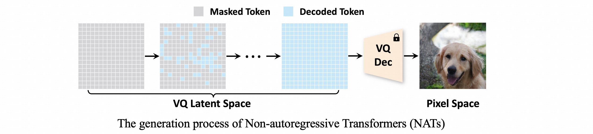

# Revisiting Non-Autoregressive Transformers for Efficient Image Synthesis (CVPR2024)
This repo contains the official PyTorch implementation of [Revisiting Non-Autoregressive Transformers for Efficient Image Synthesis](https://arxiv.org/abs/2406.05478v1).

## Overview

Non-autoregressive Transformer (NAT) is an efficient type of image synthesis model.
However, their performance is generally inferior to state-of-the-art image generation models (*e.g.* diffusion models). 
In this paper, we revisit NATs from their training & generation strategy design of NAT models, and propose AutoNAT to automatically search for better strategies for NATs.


## Installation
We support PyTorch==2.0.1 and torchvision==0.15.2. Please install them following the official instructions.

Clone this repo and install the required packages:

```shell
git clone https://github.com/LeapLabTHU/ImprovedNAT
pip install tqdm loguru numpy pandas pyyaml einops omegaconf Pillow==10.0.1 accelerate==0.25.0 xformers==0.0.21
```

## Data Preparation

- The ImageNet dataset should be prepared as follows:

```
data
├── train
│   ├── folder 1 (class 1)
│   ├── folder 2 (class 1)
│   ├── ...
```

- Tokenizing the ImageNet dataset:
Use [this link](https://drive.google.com/file/d/13S_unB87n6KKuuMdyMnyExW0G1kplTbP/view?usp=sharing) to download the pre-trained VQGAN tokenizer and put it in `assets/vqgan_jax_strongaug.ckpt`. Then run the following command to tokenize the ImageNet-256 dataset:

```shell
python extract_imagenet_feature.py --path data --split train
```
This command will save the tokenized ImageNet dataset to `assets/imagenet256_vq_features`. 

- Prepare FID-stats:
Download the FID-stats from [this link](https://drive.google.com/file/d/1C7DgARuZi9-InTYOgpkE3pggkJB6DMZD/view?usp=drive_link) and put it in `assets/fid_stats` directory.

- Prepare pre-trained inception model for FID calculation:
Download the pre-trained inception model from [this link](https://github.com/mseitzer/pytorch-fid/releases/download/fid_weights/pt_inception-2015-12-05-6726825d.pth) and put it in `assets/pt_inception-2015-12-05-6726825d.pth`.

## Pre-trained Model & Evaluation
Download our pre-trained model, namely AutoNAT-L, from [this link](https://drive.google.com/file/d/12NN62Vg1DiOd-3sWkEnBQRIBBbuiVkNl/view?usp=sharing) and put it in `assets/nnet_ema.pth`. Then run the following command for evaluation:

```shell
export ACCELERATE_MIXED_PRECISION=fp16

torchrun --nproc_per_node=8 --rdzv_backend=c10d --rdzv_endpoint=localhost:0 train.py \
--config configs/AutoNAT_L.yaml \
--gen_steps 8 \
--searched_strategy configs/AutoNAT_L-T8_strategy.yaml \
--pretrained_path assets/nnet_ema.pth \
--mode eval \
--eval_n 50000
```

## Pre-training the NAT model
To pre-train the NAT model with our searched training strategy, run the following command:

```shell
export ACCELERATE_MIXED_PRECISION=fp16

torchrun --nproc_per_node=8 --rdzv_backend=c10d --rdzv_endpoint=localhost:0 train.py \
--config configs/AutoNAT_L.yaml \
--mode pretrain \
--beta_alpha_beta 12 3
```

## Perform AutoNAT strategy search 
To perform AutoNAT strategy search, run the following command:

```shell
export ACCELERATE_MIXED_PRECISION=fp16

torchrun --nproc_per_node=8 --rdzv_backend=c10d --rdzv_endpoint=localhost:0 train.py \
--config configs/AutoNAT_L.yaml \
--gen_steps 8 \
--pretrained_path assets/nnet_ema.pth \
--mode search \
--eval_n 50000
```

Note that the above code conducts the generation strategy search in AutoNAT. We found our training strategy searched with AutoNAT-S (`--beta_alpha_beta 12 3`) performs consistently well across various NAT models. Therefore, we keep it as a default choice and focus on searching for the generation strategy.

## Citation

If you find our work useful for your research, please consider citing

```
@inproceedings{Ni2024Revisit,
  title={Revisiting Non-Autoregressive Transformers for Efficient Image Synthesis},
  author={Ni, Zanlin and Wang, Yulin and Zhou, Renping and Guo, Jiayi and Hu, Jinyi and Liu, Zhiyuan and Song, Shiji and Yao, Yuan and Huang, Gao},
  booktitle={CVPR},
  year={2024},
}
```

## Acknowledgements

Our implementation is based on
- [U-ViT](https://github.com/baofff/U-ViT) (Pre-training code and network architecture)
- [MaskGIT](https://github.com/google-research/maskgit) (NAT sampling code)
- [MAGE](https://github.com/LTH14/mage?tab=readme-ov-file) (VQGAN weights)
- [VQGAN](https://github.com/CompVis/taming-transformers) (VQGAN code)
- [pytorch-fid](https://github.com/mseitzer/pytorch-fid) (official implementation of FID in PyTorch)

We thank the authors for their excellent work.

## Contact

If you have any questions, please send mail to [nzl22@mails.tsinghua.edu.cn](mailto:nzl22@mails.tsinghua.edu.cn).
